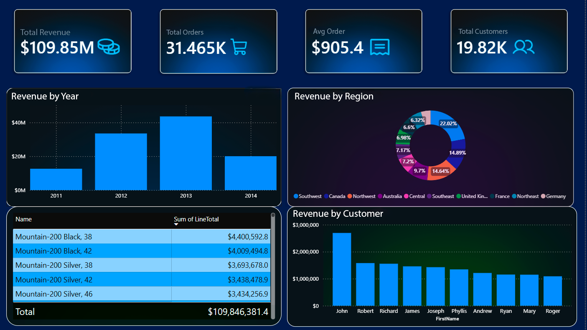

# AdventureWorks Sales Dashboard

An interactive Power BI sales analysis dashboard built on AdventureWorks (SQL Server) data.

**Context:** The Chief Commercial Officer / Sales Manager needs a single, unified view of sales—revenue, dynamics, regions, products, and customers—all on one screen. Without it, decisions are made blindly: revenue dips go unnoticed, and resources are wasted on unprofitable areas.

**Objective:** Build a sales dashboard that answers key business questions:
- What is the total revenue, and how does it change year over year?
- Which regions generate the most revenue?
- Which products / product lines lead in sales?
- Who are the key customers?
- What is the average order value, and how many customers are there?

**Business Value:** A unified sales overview allows the team to reallocate effort toward profitable regions and products, spot revenue dips in time, and reduce dependence on a narrow customer base.

## Tools
- Power BI Desktop
- Power Query
- SQL Server (data source)

## Data & Connection
- Used Microsoft's sample OLTP database **AdventureWorks** (SQL Server sample database).
- Data period: 2011–2014.
- Unlike messy CSV files, the AdventureWorks database is already structured and clean (OLTP), so the primary effort focused on data modeling and establishing relationships between tables rather than data cleaning.

## Data Model & Relationships
Loaded related sales tables and dimension tables to build a model where sales tables (orders and line items) are linked to customer, product, and region dimensions:

**Sales Tables:**
- `Sales.SalesOrderHeader` — orders (date, customer, territory)
- `Sales.SalesOrderDetail` — order line items (product, quantity, revenue `LineTotal`)

**Dimensions:**
- `Sales.Customer` — customers
- `Sales.SalesTerritory` — sales territories / regions
- `Production.Product` — products
- `Person` — customer names

**Table Relationships:**
- `SalesOrderHeader[SalesOrderID]` ↔ `SalesOrderDetail[SalesOrderID]` — aggregate revenue by order
- `SalesOrderDetail[ProductID]` ↔ `Product[ProductID]` — slice revenue by product
- `SalesOrderHeader[CustomerID]` ↔ `Customer[CustomerID]` — track customer purchases
- `Customer[PersonID]` ↔ `Person[BusinessEntityID]` — display customer names
- `SalesTerritory` dimension linked via `TerritoryID` (present in both orders and customers in AdventureWorks) — slice revenue by region

These relationships allow a single visual to pull revenue directly from `SalesOrderDetail` and break it down across regions, products, and customers from the dimension tables.

## Metrics
No custom DAX measures were written; metrics were built using Power BI's implicit aggregations on model fields. Below is what each KPI card actually calculates:

| Card Metric | Field | Aggregation | What it actually calculates |
|---|---|---|---|
| Total Revenue | `SalesOrderDetail[LineTotal]` | Sum | Total revenue |
| Total Orders | `SalesOrderHeader[SalesOrderID]` | Count | Number of orders |
| Avg Order Value | `SalesOrderDetail[LineTotal]` | Average | Average **line item amount**, not per-order total (see limitation note) |
| Total Customers | `Customer[CustomerID]` | Count | Number of records in the customer dimension |

## Visualizations
- **KPI Cards** — key metrics displayed at the top (Total Revenue, Total Orders, Avg Order Value, Total Customers)
- **Column chart** — annual revenue trends (Revenue by Year): X-axis — year from `OrderDate`, values — Sum of `LineTotal`
- **Donut chart** — revenue by region (Revenue by Region): `SalesTerritory[Name]`
- **Bar chart** — revenue by customer (Revenue by Customer): `Person[FirstName]`
- **Table** — top products by revenue (Top Products by Revenue): `Product[Name]`

## Design
- Dark professional theme
- Top-level KPIs for a quick overview
- Top-down layout structure: from high-level summaries to granular details
- English business terminology for metric labels instead of technical field names

## Skills
- SQL Server connection
- Data modeling: establishing relationships between fact and dimension tables (Star Schema)
- Building metrics using implicit Power BI aggregations (Sum, Count, Average)
- Dashboard design and UX
- Business intelligence and insight generation
- Working with OLTP schemas (complex normalized tables)

## Key Insights
- **Overall Volume:** $109.85M revenue · 31.5K orders · $905 average line item value · 19.8K customers
- **Dynamics:** Peak sales occurred in 2013, followed by a drop in 2014. *Note:* The 2014 drop reflects incomplete data rather than an actual business downturn (AdventureWorks data only runs through June 30, 2014).
- **Regional Concentration:** The Southwest region accounts for ~22% of total revenue, indicating significant reliance on a single market.
- **Top Products:** Revenue is primarily driven by the Mountain-200 product line.
- **Customer Base:** Revenue is concentrated among a small group of key customers.

This is a portfolio project based on Microsoft's public dataset, structured to address real-world business requirements.

**Data Source:** [AdventureWorks Sales Dashboard](https://github.com/Microsoft/sql-server-samples/releases/#release-adventureworks) SQL Server sample database.

**Time Spent:** 5 days
