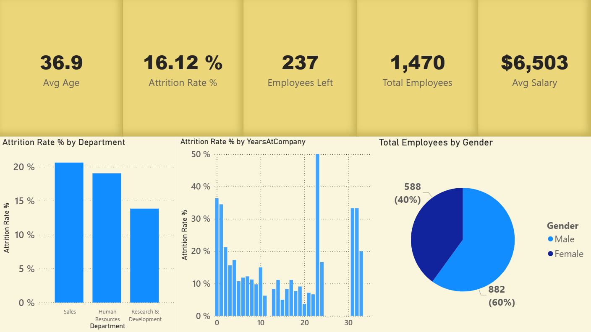
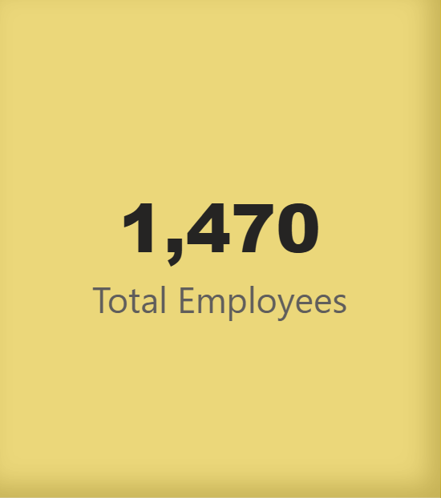
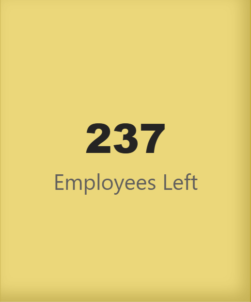
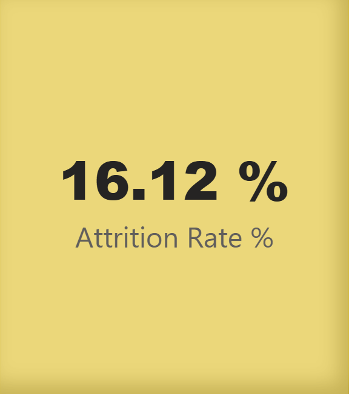
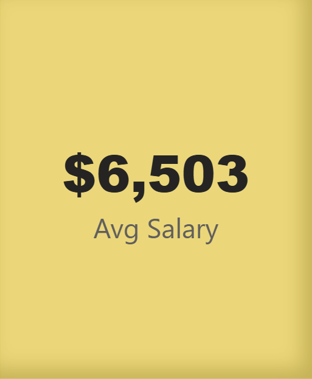
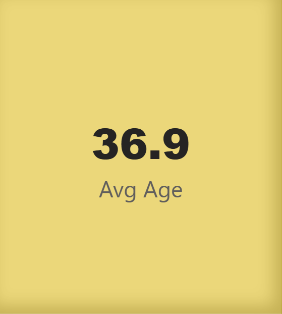

# Portfolio
# 👥 HR Analytics Dashboard



## 🇷🇺 About the Project

Interactive Power BI dashboard for analyzing employee attrition.

## 🎯 Business Task

**Task Context:** Replacing one employee costs the company 50-200% of their annual salary. High employee turnover leads to millions in losses.

**Task:** Conduct a diagnostic analysis of resignations to identify risk factors:
- Which employees leave most often?
- Which departments have the highest turnover?
- What factors (salary, overtime, tenure) affect resignations?
- Who is in the risk group right now?

**Business Value:** Reducing turnover by 10% saves millions of dollars.

## 🛠️ Tools
- Power BI Desktop
- DAX (Data Analysis Expressions)
- Power Query (data cleaning and transformation)
- CSV (data source)

## What I Did

### 1. Data Preparation
- Imported HR Analytics dataset (~1,470 employees, 35 fields)
- Cleaned data in Power Query: checked data types, removed errors
- Created calculated columns:
  - `Age Group` (18-25, 26-35, 36-45, 46-55, 55+)
  - `Salary Band` (Low, Medium, High, Very High)

### 2. DAX Measures

**Total Employees**



Measure:
```
Total Employees = COUNTROWS('HR')
```

**Employees Left**



Measure:
```
Employees Left = 
CALCULATE(
    COUNTROWS('HR'),
    'HR'[Attrition] = "Yes"
)
```

**Attrition Rate %**



Measure:
```
Attrition Rate % = 
DIVIDE(
    [Employees Left],
    [Total Employees],
    0
)
```

**Avg Salary**



Measure:
```
Avg Salary = AVERAGE('HR'[MonthlyIncome])
```

**Avg Age**



Measure:
```
Avg Age = AVERAGE('HR'[Age])
```

### 3. Visualization
- **KPI cards** — key metrics at the top
- **Bar chart** — turnover by departments
- **Bar chart** — turnover by years of service
- **Pie chart** — gender distribution

### 4. Design
- KPIs at the top for quick overview
- "Top-down" structure: from overall numbers to details
- Interactive filters (Department, OverTime)

## Skills I Applied

- Working with Power Query (cleaning, transformation, creation, etc.)
- Writing DAX measures (CALCULATE, DIVIDE, COUNTROWS, AVERAGE)
- Dashboard visual design
- Business analytics and insight identification
- Working with CSV data

## 📈 Key Insights
- **Turnover:** 16.12% (237 employees)
- **Total employees:** 1,470
- **Average age:** 36.9 years
- **Average salary:** ~$6,500/month
- **Problem departments:** Sales, Human Resources
- **Risk:** Employees leave more often within the first 1-2 years

## 💡 Recommendations
1. Improve onboarding for new employees
2. Audit **Sales** and **HR** departments
3. Control overtime
4. Competitive salary

## 📂 Dataset
This is an educational project on a public dataset,
but I formulated the task as if it were set by a real business

**Source:** [HR Employee Attrition on Kaggle](https://www.kaggle.com/datasets/saurabhbadole/hr-employee-attrition)

**Time spent:** 2 days
