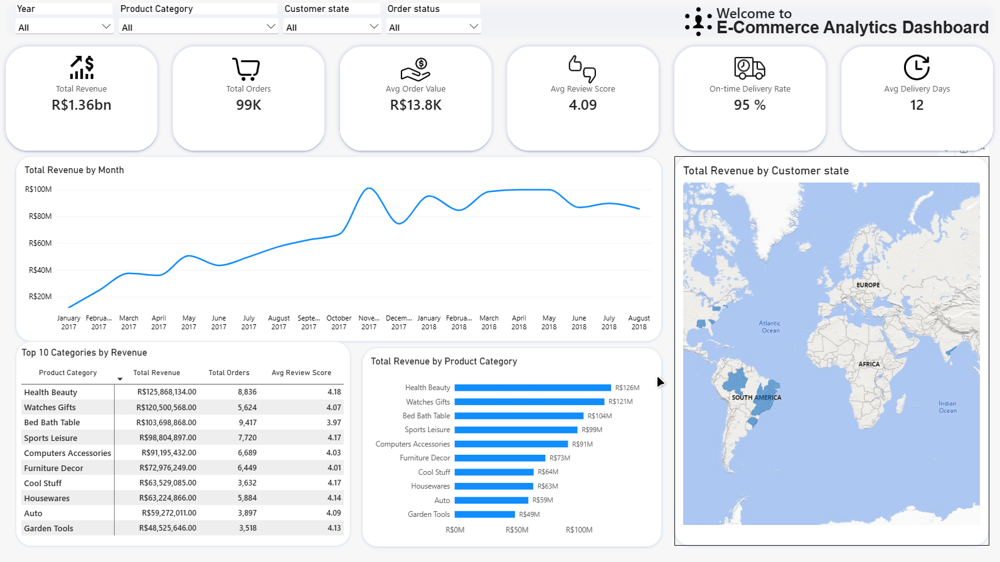

# 🛒 Дашборд анализа бразильского e-commerce Olist (Power BI)
##### [← Назад к портфолио](../README_RU.md) | [Switch to English](README.md)


## 🇷🇺 О проекте

Дашборд в Power BI для анализа эффективности бразильского маркетплейса Olist: динамика выручки, топ категорий, география заказов, качество доставки и отзывы клиентов.

### 🎯 Бизнес-задача

**Контекст:** Olist — маркетплейс электроники и товаров для дома. Данные охватывают период сентябрь 2016 — сентябрь 2018 (≈99K заказов, ≈112K позиций).
**Задача:** Создать единое окно мониторинга, отвечающее на вопросы:
- Как растёт выручка по месяцам и кварталам?
- Какие категории товаров генерируют максимальную выручку?
- Какие штаты Бразилии лидируют по заказам?
- Насколько качественно работает доставка (срок, своевременность)?
- Как клиенты оценивают покупки (рейтинг)?

**Бизнес-ценность:** Выявление сезонности, топ-категорий и географических лидеров позволяет оптимизировать логистику, маркетинговый бюджет и ассортиментную матрицу.

## 🛠️ Инструменты

- Power BI Desktop
- DAX (меры, итераторы, Calendar table)
- Power Query (очистка, Replace Values, Capitalize Each Word)
- CSV (6 файлов датасета Olist)

## Что я сделал

### 1. Подготовка данных
- Загрузил 6 CSV-файлов: `olist_customers_dataset`, `olist_order_items_dataset`, `olist_order_reviews_dataset`, `olist_orders_dataset`, `olist_products_dataset`, `product_category_name_translation` (geolocation / payments / sellers не использовались).
- Очистка в Power Query: замена `_` на пробел в названиях категорий → `Capitalize Each Word` (`health_beauty` → `Health Beauty`).
- Обработка пропусков: null в категориях закрыт вычисляемым столбцом Product Category (IF(ISBLANK(...), "Other", ...)), чтобы не терять заказы в расчётах и убрать (Blank) из среза.
- Создан вычисляемый столбец `Date.OrderPurchase` (тип Date) для корректной связи с Calendar.
- Связи в модели (star schema):
  - `Calendar[Date]` → `orders[Date.OrderPurchase]` (1:*)
  - `orders[order_id]` → `order_items[order_id]` (1:*)
  - `orders[order_id]` → `order_reviews[order_id]` (1:*)
  - `orders[customer_id]` → `customers[customer_id]` (*:1)
  - `order_items[product_id]` → `products[product_id]` (*:1)
  - `products[product_category_name]` → `translations[product_category_name]` (*:1)

### 2. Календарная таблица
```dax
Calendar = CALENDAR(MIN('olist_orders_dataset'[order_purchase_timestamp]), MAX('olist_orders_dataset'[order_purchase_timestamp]))
```
Столбцы: `Year`, `Month`, `Quarter`, `MonthKey`, `MonthNumber`. Сортировка `Month` выполнена по `MonthKey`, а не по номеру месяца (последний повторяется каждый год и ломает хронологию — отсюда «пила» на графике до фикса).

### 3. DAX-меры (таблица `_Metrics`)

**Total Revenue**
```dax
Total Revenue = SUM('olist_order_items_dataset'[price])
```

**Total Orders**
```dax
Total Orders = DISTINCTCOUNT('olist_orders_dataset'[order_id])
```

**Avg Order Value**
```dax
Avg Order Value = AVERAGEX(DISTINCT('olist_orders_dataset'[order_id]), CALCULATE(SUM('olist_order_items_dataset'[price])))
```

**Avg Review Score**
```dax
Avg Review Score = AVERAGE('olist_order_reviews_dataset'[review_score])
```

**On-time Delivery Rate**
```dax
On-time Delivery Rate = 
DIVIDE(
    CALCULATE(
        COUNTROWS('olist_orders_dataset'),
        'olist_orders_dataset'[order_delivered_customer_date] <= 'olist_orders_dataset'[order_estimated_delivery_date]
    ),
    CALCULATE(
        COUNTROWS('olist_orders_dataset'),
        NOT ISBLANK('olist_orders_dataset'[order_delivered_customer_date])
    ),
    0
)
```

**Avg Delivery Days**
```dax
Avg Delivery Days = 
AVERAGEX(
    FILTER(
        'olist_orders_dataset',
        NOT ISBLANK('olist_orders_dataset'[order_delivered_customer_date])
    ),
    DATEDIFF(
        'olist_orders_dataset'[order_purchase_timestamp],
        'olist_orders_dataset'[order_delivered_customer_date],
        DAY
    )
)
```

**Total Freight**
```dax
Total Freight = SUM('olist_order_items_dataset'[freight_value])
```

**Total Items**
```dax
Total Items = COUNTROWS('olist_order_items_dataset')
```
> В датасете Olist нет поля `quantity`: каждая строка `order_items` — одна позиция товара, поэтому количество считается как число строк, а не суммой `order_item_id` (это индекс позиции внутри заказа).

### 4. Визуализация
- **KPI-карточки** (6) — Total Revenue, Total Orders, Avg Order Value, Avg Review Score, On-time Delivery Rate, Avg Delivery Days с png-иконками.
- **Line Chart** — динамика выручки по месяцам (`Calendar[Month]` × `Total Revenue`), видимый диапазон Jan 2017 – Aug 2018 (2016 исключён так как были обрывы данных, Sep 2018 — неполный; фильтр локальный, на визуале).
- **Bar Chart (горизонтальный)** — выручка по категориям (`Product Category` × `Total Revenue`), топ-10.
- **Matrix** — `Top 10 Categories` (`Product Category` x `Total Revenue`, `Total Orders`, `Avg Review Score`).
- **Map (bubble)** — выручка по штатам (`Customer state` × `Total Revenue`).
- **Slicers** (4, Dropdown) — Year, Product Category, Customer state, Order Status.
- Подписи данных включены на столбчатых диаграммах для мгновенного чтения.

### 5. Дизайн
- Фон `#FAFAFA`, карточки `#FFFFFF` с закруглёнными углами 30px.
- Акцентный цвет `#118DFF`, иконки интегрированы внутрь KPI-карточек.
- Заголовок канваса в две строки: «Welcome to» (мелко) + название продукта (крупно).
- Все заголовки визуалов и срезов — на английском.



## Применённые навыки

- Работа с Power Query (замена значений, каждое слово с заглавной буквы, типы данных)
- Написание DAX-мер (`AVERAGEX, AVERAGE, CALCULATE, DIVIDE, COUNTROWS, FILTER, DATEDIFF, DISTINCT, DISTINCTCOUNT, SUM, ISBLANK`)
- Построение Calendar table и time intelligence
- UI дизайн дашбордов

## 📈 Ключевые инсайты

- **Выручка:** R$ 1.36 млрд за период, ≈99K заказов, ≈112K позиций.
- **Средний чек:** R$ ≈13,800. Olist — маркетплейс электроники и товаров для дома (топ: Health Beauty, Watches Gifts, Computers Accessories), поэтому чек выше продуктового e-commerce; метрика отражает среднюю выручку на заказ, включая мульти-товарные корзины.
- **Рейтинг:** Avg Review Score 4.09/5 — высокая удовлетворённость клиентов.
- **Доставка:** On-time Delivery Rate ≈95%, средний срок ≈12 дней.
- **Топ категории:** Health Beauty (R$ 126M), Watches Gifts (R$ 121M), Bed Bath Table (R$ 104M), Sports Leisure (R$ 99M), Computers Accessories (R$ 91M).
- **Сезонность:** рост выручки 2017 → 2018, пики в Q4 (Black Friday в ноябре, рождественский сезон в декабре).
- **География:** штаты Юго-Востока (São Paulo, Rio de Janeiro, Minas Gerais) — лидеры по заказам.

## 💡 Рекомендации

1. **Ассортимент:** усилить топ-5 категорий — они генерируют основную выручку.
2. **Логистика:** разобрать причины ≈5% опозданий по штатам и категориям.
3. **Сезонность:** готовить складские запасы и маркетинг к Q4 — исторически пиковый период.
4. **География:** расширять присутствие за пределами Юго-Востока.

## 📂 Датасет

Учебный проект на публичном датасете Brazilian E-Commerce by Olist, адаптированный под задачи реального e-commerce-анализа.

**Источник:** [Brazilian E-Commerce Public Dataset by Olist на Kaggle](https://www.kaggle.com/datasets/olistbr/brazilian-ecommerce)

**Период:** сентябрь 2016 — сентябрь 2018. 2016 год — период запуска магазина, данные в нём неравномерны (октябрь содержит батч исторических заказов, ноябрь–декабрь — провал), сентябрь 2018 неполный. На графике динамики выручки показан репрезентативный период январь 2017 — август 2018; остальные метрики (KPI, категории, штаты) считаются по полной базе.

**Валюта:** все суммы в датасете — в бразильских реалах (BRL). На дашборде и в README использован знак `R$`; конвертация в USD сознательно не выполнена, чтобы не вносить погрешность по курсу 2017–2018 гг.

**Объём:** 6 CSV-файлов; ≈99K заказов, ≈112K позиций; справочники — products, customers, order_reviews, translations.

**Файл:** [📥 Скачать .pbix файл](https://github.com/Mangil123123/portfolio/releases/download/v1.0/brazilian.e_commerce.pbix) (итоговый отчёт, для просмотра понадобится бесплатная программа Power BI Desktop)

**Затрачено времени:** 6 дней


## 🗂️ Другие проекты

| | | |
|---|---|---|
| <a href="../Telco_Churn/README_RU.md"></a> | <a href="../Superstore/README_RU.md"></a> | <a href="../Airbnb_NYC/README_RU.md"></a> |
| **Telco Churn** | **Superstore** | **Airbnb NYC** |
| Отток клиентов телеком | Ритейл-аналитика | Рынок аренды |

| | | |
|---|---|---|
| <a href="../HR_Employee_Attrition/README_RU.md"></a> | <a href="../AdventureWorks_Sales_Dashboard/README_RU.md"></a> | <a href="../Netflix_analysis/README_RU.md"></a> |
| **HR Analytics** | **AdventureWorks Sales** | **Netflix Analysis** |
| Текучесть персонала | Анализ продаж велосипедов | Анализ контента Netflix |

[← Назад к портфолио](../README_RU.md)
