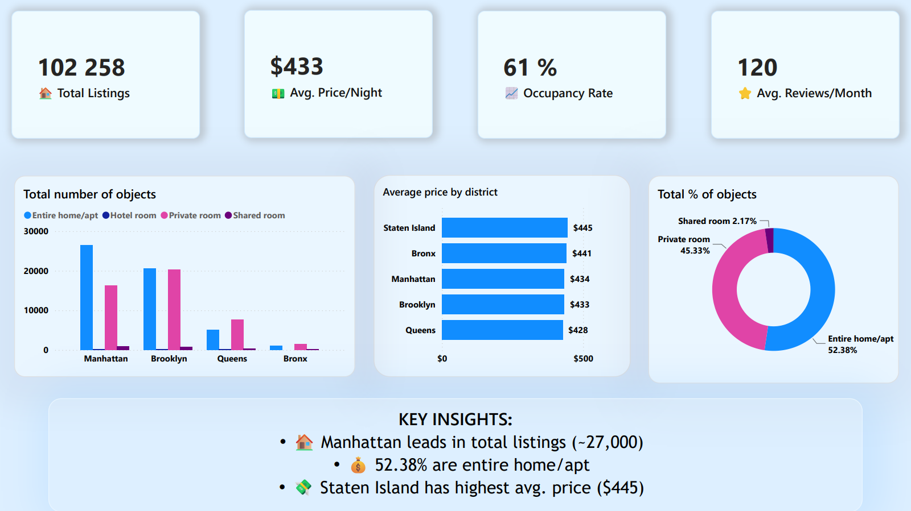

# My Portfolio
I specialize in data visualization: I take raw data (Excel, CSV, database exports), clean and transform it using Power Query, and build interactive dashboards in Power BI (DAX, Power Query).
## Projects

### 🏪 Superstore Sales Analysis Dashboard

Minimalist Power BI dashboard for analyzing sales dynamics and structure of a retail network.
[View Project →](Superstore/README.md)

### 🏠 Airbnb NYC Market Analysis Dashboard

Interactive Power BI dashboard for analyzing the short-term rental market in New York City.
[View Project →](Airbnb_NYC/README.md)

### 📈 AdventureWorks Sales

An interactive Power BI sales analysis dashboard built on AdventureWorks
[View Project →](AdventureWorks_Sales_Dashboard/README.md)

### 🎬 Netflix Content Analysis

Interactive dashboard analyzing Netflix content library
[View Project →](Netflix_analysis/README.md)

### 👥 HR Employee Attrition

Interactive Power BI dashboard for analyzing employee attrition
[View Project →](HR_Employee_Attrition/README.md)
