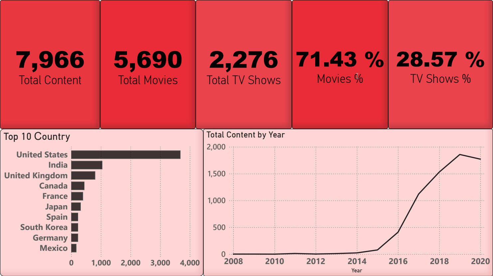

# portfolio
# 🎬 Netflix Content Analysis Dashboard



## 🇷🇺 О проекте (Russian)

Интерактивный дашборд для анализа библиотеки контента Netflix: распределение по типам, странам и тренды по годам.

## 🎯 Бизнес-задача

Задача: Провести описательный анализ (descriptive analytics) библиотеки 
контента Netflix для выявления структурных характеристик и трендов:

- Какова структура библиотеки по типам контента (фильмы/сериалы)?
- Как распределён контент по странам производства?
- Как менялось количество добавляемого контента по годам?
- Какие закономерности можно выявить на основе доступных метаданных?

Ограничения: Анализ не включает оценку эффективности контента 
(просмотры, удержание, ROI), так как эти данные не представлены 
в публичном датасете.

Ценность для бизнеса: Понимание структуры и динамики библиотеки — 
первый шаг для формирования гипотез о контент-стратегии. 

### 🛠️ Инструменты
- Power BI Desktop
- DAX (Data Analysis Expressions)
- Power Query (очистка данных)
- CSV (источник данных)

## Что я сделал

### 1. Подготовка данных

- Импортировал датасет Netflix (~8,796 записей) из CSV файла
- Очистил данные в Power Query: удалил пустые значения, ошибки, дубликаты, раделил некоторые столбцы/строки и др.

### 2. Создание мер на DAX

- Total Content — общее количество контента:
```
Total Content = 
DISTINCTCOUNT('netflix_titles'[show_id])
```
- Total Movies — количество фильмов:
```
Total Movies = 
CALCULATE(
    DISTINCTCOUNT('netflix_titles'[show_id]),
    'netflix_titles'[Type] = "Movie"
)
```
- Total TV Shows — количество сериалов:
```
Total TV Shows = 
CALCULATE(
    DISTINCTCOUNT('netflix_titles'[show_id]),
    'netflix_titles'[Type] = "TV Show"
)
```
- Movies % — процент фильмов от общего числа
```
Movies % = 
DIVIDE(
    [Total Movies],
    [Total Content],
    0
)
```
- TV Shows % — процент сериалов:
```
TV Shows % = 
DIVIDE(
    [Total TV Shows],
    [Total Content],
    0
)
```
- YoY Growth — рост контента по годам:
```
YoY Growth =
CALCULATE(
[Total Content],
SAMEPERIODLASTYEAR(netflix_titles[date_added]))
```
### 3. Визуализация данных

- KPI карточки — ключевые метрики в верхней части дашборда
- Столбчатая диаграмма — топ-10 стран по количеству контента (использовал визуальный фильтр для топ 10)
- Линейный график — динамика добавления контента по годам (2008-2020, использовал фильтр меньше или равно для 2020 года, так как данные резко обрывались после 2020 года)

### 4. Дизайн и UX

- Разместил KPI сверху для быстрого обзора
- Настроил цвет (Взял за основу дизайн Netflix)
- Добавил заголовки и подписи ко всем графикам
- Перевёл интерфейс на английский для международного портфолио
- Добавил внутренние тени для современности, сглаживание по краям

### 5. Анализ

- Выявил доминирование США по производству контента
- Обнаружил резкий рост библиотеки с 2014 года
- Определил пик добавления контента в 2018-2019 годах
- Проанализировал соотношение фильмов и сериалов (70/30)

## Навыки, которые я применил

- Работа с Power Query (очистка, трансформация, объединение данных и тд.)
- Написание мер на DAX (CALCULATE, DIVIDE, SAMEPERIODLASTYEAR, DISTINCTCOUNT)
- Визуальный дизайн дашбордов
- Бизнес-аналитика и выявление инсайтов
- Работа с CSV данными

### 📈 Ключевые инсайты
- Всего контента: 7,966 штук
- Соотношение: 69.7% Фильмы vs 30.3% Сериалы
- Лидер по стране: США лидируют (3,500+), Индия на 2 месте (1,000+), Великобритания на 3 месте (800+)
- Тренд роста: Библиотека контента выросла в 4-5 раз за 5 лет (2014-2019)
- Обновление каталога: 90% контента добавлено после 2014 года

### 📂 Датасет
Это учебный проект на публичном датасете,
но я формулировал задачу так, как если бы её поставил реальный бизнес

ВРЕМЯ РАБОТЫ: 2 ДНЯ
Источник: [Netflix Movies and TV Shows на Kaggle](https://www.kaggle.com/datasets/shivamb/netflix-shows)
