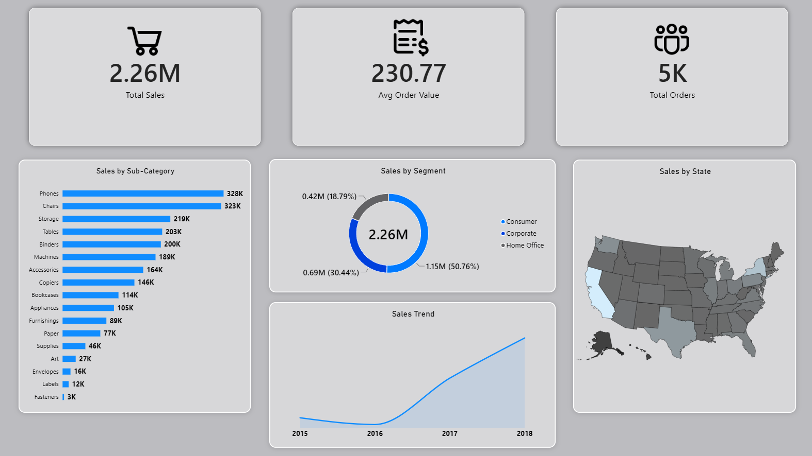

# 📊 Дашборд анализа продаж Superstore Sales



## 🇷🇺 О проекте

Минималистичный дашборд в Power BI для анализа динамики и структуры продаж ритейл-сети.

###  Бизнес-задача

**Контекст:** Ритейл-компания нуждается в отслеживании ключевых метрик продаж.
**Задача:** Создать единое окно мониторинга, отвечающее на вопросы:
- Какова общая выручка и средний чек?
- Какие категории товаров генерируют основной доход?
- Как меняется динамика продаж по годам?
- Какой клиентский сегмент является основным?
- Как распределяются продажи по регионам?

**Бизнес-ценность:** Снижение времени на анализ отчетов за счет интуитивного интерфейса и фокусировки на топ-категориях позволяет быстрее выявлять тренды и аномалии.

## 🛠️ Инструменты

- Power BI Desktop
- DAX
- Power Query (восстановление данных)
- CSV (источник данных)

## Что я сделал

### 1. Подготовка данных
- Восстановил датасет после критической ошибки: при первой очистке было случайно удалено 70% строк (Total Sales упал с 2.26M до 600K).
- Решил проблему битых дат без риска потери данных.

### 2. DAX-меры

**Total Sales**
```dax
Total Sales = SUM('train'[Sales])
```

**Avg Order Value**
```dax
Avg Order Value = DIVIDE([Total Sales], [Total Orders])
```

**Total Orders**
```dax
Total Orders = DISTINCTCOUNT('train'[Order ID])
```

**Year**
```dax
Year = RIGHT('train'[Order Date], 4)
```

### 3. Визуализация
- **KPI-карточки** — Total Sales, Avg Order Value, Total Orders с встроенными SVG-иконками.
- **Bar Chart** — Продажи по подкатегориям.
- **Donut Chart** — Распределение по сегментам.
- **Line Chart** — Тренд продаж по годам.
- **Map** — География продаж США.

### 4. Дизайн
- Строгий минимализм: фон `#E5E5EA`, карточки `#FFFFFF`, скругления 12px.
- Убраны все лишние элементы: оси X/Y, сетки, рамки.
- Цветовая схема: синий, белый, серый.
- Иконки интегрированы внутрь KPI-карточек через визуализацию image.


## Применённые навыки

- Экстренное восстановление данных и работа с ошибками ETL
- Написание DAX-мер (DISTINCTCOUNT, DIVIDE, RIGHT, SUM) 
- Условное форматирование (Rules) для кастомных цветовых схем
- UI дизайн дашбордов 
- Оптимизация визуалов

##  Ключевые инсайты

- **Динамика:** Стабильный рост продаж с 2016 года.
- **Лидеры категорий:** Phones (328K) и Chairs (323K) генерируют ~30% всей выручки.
- **Сегментация:** Consumer — лидер (50.76%), Corporate занимает второе место (30.44%).
- **География:** Калифорния и Нью-Йорк — ключевые рынки, центральные штаты требуют внимания.

## 💡 Рекомендации

1. **Для маркетинга:** Усилить продвижение в сегменте Corporate (потенциал роста 30%).
2. **Ассортимент:** Фокус на Phones и Chairs как локомотивах продаж.
3. **Анализ:** Провести глубинный анализ центральных штатов (серая зона на карте) для выявления скрытого спроса.

##  Датасет

Учебный проект на публичном датасете Superstore, адаптированный под задачи реального ритейл-анализа.

**Источник:** [Superstore Sales Dataset на Kaggle](https://www.kaggle.com/datasets/rohitsahoo/sales-forecasting)

**Файл:** [📥Скачать .pbix файл](https://raw.githubusercontent.com/Mangil123123/portfolio/main/Superstore/Files/Superstore.pbix) (итоговый отчёт, для просмотра понадобится бесплатная программа Power BI Desktop)

**Затрачено времени:** 4 дня
