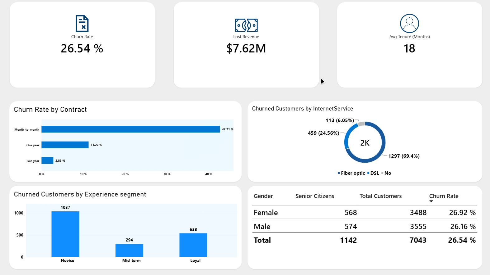

# 📉 Telco Customer Churn Analysis Dashboard


## 🇬🇧 About the Project

Minimalist Power BI dashboard for analyzing the causes and cost of customer churn at a telecom operator.

### 🎯 Business Problem

**Context:** A telecom operator serves 7,043 phone and internet subscribers (California). Around 26% of customers terminate service, and each departure means lost recurring revenue.
**Task:** Build a single churn-monitoring view that answers:
- What is the overall churn rate and how much revenue is lost?
- Which contract type carries the highest risk?
- Which internet plans generate the most churn?
- At which tenure stage do customers leave most often?
- Is there a demographic difference in churn?

**Business value:** Retaining an existing subscriber is cheaper than acquiring a new one. Segmenting by churn risk lets resources target critical groups before cancellation, not after the fact.

## 🛠️ Tools

- Power BI Desktop
- DAX
- Power Query (data cleaning and transformation)
- CSV (data source)

## What I Did

### 1. Data Preparation
- Renamed columns for readability: `customerID` → `CustomerID`, `gender` → `Gender`, `tenure` → `Tenure`, `MonthlyCharges` → `MonthlyRevenue`.
- Set data types: `Tenure` — Whole Number, `MonthlyRevenue` — Decimal Number, `Churn` — Text.
- Replaced values in the `Churn` column: `Yes` → `Left`, `No` → `Stayed` (consistent form for filters and measures).
- Created a conditional column `Experience segment` by tenure: `Tenure ≤ 12` → `Novice`, `≤ 24` → `Mid-term`, else → `Loyal`.

### 2. DAX Measures

**Total Customers**
```dax
Total Customers = COUNTROWS('Telco')
```

**Churned Customers**
```dax
Churned Customers = CALCULATE([Total Customers], 'Telco'[Churn] = "Left")
```

**Lost Revenue**
```dax
Lost Revenue = CALCULATE(SUM('Telco'[MonthlyRevenue]), 'Telco'[Churn] = "Left")
```

**Churn Rate %**
```dax
Churn Rate % = DIVIDE([Churned Customers], [Total Customers], 0)
```

**Avg Tenure (Months)**
```dax
Avg Tenure (Months) = AVERAGE('Telco'[Tenure])
```

### 3. Visualization
- **KPI cards** — Churn Rate, Lost Revenue, Avg Tenure with png icons.
- **Bar Chart** — churn by contract type (`Contract` × `Churn Rate %`).
- **Donut Chart** — distribution of churned customers by internet plan (`InternetService`)
- **Column Chart** — churned customers by tenure cohort (`Experience segment` × `Churned Customers`).
- **Table** — demographic breakdown (`Gender`, `Senior Citizens`, `Total Customers`, `Churn Rate %`), sorted by churn.
- Data labels enabled on the bar/column charts for instant reading.

### 4. Design
- Strict minimalism: background `#EEEEEE`, cards `#FFFFFF`, 30px corner radius.
- Removed borders and duplicate titles. Numeric axes and horizontal gridlines kept on the bar/column charts for scale reading; values additionally duplicated via data labels.
- Color scheme: blue, white, gray.
- Icons integrated inside the KPI cards via the image visual.
- No sparklines used: the dataset has no time column, so a line over tenure would fake a trend that does not exist in the data.



## Skills Applied

- Power Query work (renaming, types, value replacement, conditional columns)
- Writing DAX measures (COUNTROWS, CALCULATE, SUM, AVERAGE, DIVIDE) with divide-by-zero protection
- Visual-level filtering to separate "whole base" from "churned"
- Metric validation: Churn Rate 26.54% cross-checked against the dataset's reference churn level (~26%)
- Dashboard UI design
- Visual optimization

## 📈 Key Insights

- **Overall churn:** 26.54% of the base (1,869 of 7,043 left), lost revenue — $7.62M.
- **Contract is the main driver:** month-to-month contracts churn at 42.71% versus 2.83% on two-year terms. A term commitment cuts churn by ~15x.
- **Plan:** fiber optic accounts for 69.4% of all churned customers (1,297), DSL — 24.56% (459), no internet — 6.05% (113).
- **Tenure:** novices (Novice, 0–12 months) leave en masse — 1,037 people versus 538 loyal and 294 mid-term. The critical period is the first year.
- **Demographics:** gender differences are minimal (Female 26.92% vs Male 26.16%); gender is not a meaningful predictor.

## 💡 Recommendations

1. **Retention:** focus resources on the first 12 months of service and on month-to-month customers with fiber optic.
2. **Contracts:** incentivize switching to annual/two-year terms (discount, bonus) — this cuts churn by ~15x (42.71% → 2.83%).
3. **Quality:** run a deep analysis of the fiber optic segment (technical issues, onboarding, pricing) as the source of 69% of departures.

## 📂 Dataset

Learning project on the public Telco Customer Churn dataset, framed as a real telecom-analytics task.

**Source:** [Telco Customer Churn on Kaggle](https://www.kaggle.com/datasets/blastchar/telco-customer-churn)

**File:** [📥Download .pbix File](https://raw.githubusercontent.com/Mangil123123/portfolio/main/Telco_Churn/Files/churn_dashboard.pbix) (Final report; requires free Power BI Desktop to view)

**Time spent:** 5 days
